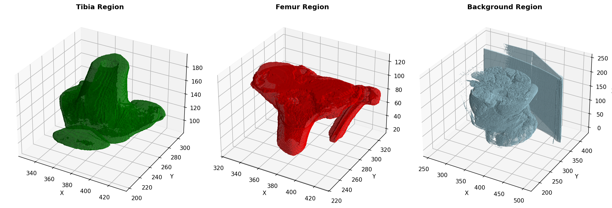

# Feature Extraction and Comparison from Knee CT Scan

This project implements a complete pipeline to extract region-wise features from a 3D knee CT scan and compare them using a 3D version of a pretrained DenseNet121 model.

---

## Overview

The goal is to: [For more Details View Task](Task_III.pdf)
1. Segment the knee CT into three regions:
   - **Tibia (Green)**
   - **Femur (Red)**
   - **Background (Black)**
2. Convert a pretrained 2D DenseNet121 into 3D by inflating convolution layers.
3. Extract feature vectors from specified convolutional layers.
    - Last convolution layer 
    - Third-last convolution layer 
    - Fifth-last convolution layer
4. Compute cosine similarity between features of (Tibia ↔ Femur, Tibia ↔ Background, Femur ↔ Background) from all 3 layers.
5. Save the results in a CSV file.


---

### Pipeline Architecture
`CT Scan Input → Segmentation → 2D→3D Model Conversion → Feature Extraction → Similarity Analysis → Results`
### Pipeline Steps:
- Segmentation-Based Splitting: Separate 3D knee CT into three regions
- 2D to 3D Model Conversion: Inflate pretrained DenseNet121 weights
- Feature Extraction: Extract features from multiple network layers
- Feature Comparison: Compute cosine similarities between regions
- Result Organization: Save results in structured CSV format

---

## Project Structure

```
.
├── data/                               # Input CT scan data
├── results/  
|   |-  task3                           # actual results of task-III
├── src/                                # Source code
│   ├── segement.py                     # Bone segmentation implementation
│   ├── feature_extractor_pipeline.py   # 
│   ├── feature_extractor.py            # feature extraction and cosine similarity
│   └── DenseNet_3d.py                  # 3D inflated DenseNet121 
└── utils/                              # Utility functions
    ├── nifti_file_handling.py          # NIfTI file operations
    ├── visualization.py                # Visualization tools
    ├── animation.py                    # Animation generation
    ├── cnn_utils.py                    # conversion of mask for CNN(DenseNet121)
    └── utils.py   
├── main.py                             # main function to run pipeline
├── similarity_results.csv              # results required for the Task-III

```

---

### Segemetation Visualization 


--- 

## Technical Details
### 1. Segmentation Approach
 
1. Intensity Thresholding: Uses CT Hounsfield Units (HU) for bone detection
2. Connected Components: Identifies and separates anatomical structures
3. Anatomical Separation: Uses z-coordinate centroids to distinguish femur/tibia
4. Region Preparation:
    - Tibia region (Green, value=1)
    - Femur region (Red, value=2)
    - Background region (Black, value=0)
4. A color-coded mask (Femur=2, Tibia=1, Background=0) is created for downstream processing.

**For more Details:**[Medical Image Preocession repo](https://github.com/Kishor978/Medical_imageprocessing.git)

### 2.  2D to 3D Weight Inflation
The feature extractor is built by inflating the pretrained **2D DenseNet121** from `torchvision.models` into a fully 3D convolutional network. This allows the model to process volumetric CT data (e.g., shape: `[C, D, H, W]`) instead of 2D images.

**Steps involved in the inflation:**

#### 2.1 Initial Model Load
```python
model_2d = torchvision.models.densenet121(weights='IMAGENET1K_V1')
```
- This loads a pretrained model trained on ImageNet.

#### 2.2 Conv2D → Conv3D Inflation
Each Conv2d layer is transformed into a Conv3d layer:

The pretrained 2D weight shape:
(out_channels, in_channels, height, width)

This is inflated to 3D by repeating across the depth dimension:

```python
weight3d = weight2d.unsqueeze(2).repeat(1, 1, depth, 1, 1) / depth
```
This preserves the total magnitude of activation across spatial dimensions.
**Example:**

- 2D kernel: (64, 3, 7, 7)
- Inflated to 3D: (64, 3, 3, 7, 7) where 3 is the depth
#### 2.3 BatchNorm2D → BatchNorm3D
All BatchNorm2d layers are replaced with BatchNorm3d, copying:
- weight, bias
- running_mean, running_var

#### 2.4 Inflated Blocks
All major submodules are recursively inflated:
- conv0, norm0
- denseblock1–4
- transition1–3

This is done with a recursive **replace_module_2d_to_3d()** function that walks through child layers and inflates/rewires as needed.
The final model accepts 3D inputs of shape:`[batch_size, 1, depth, height, width]`

### 3. Feature Extraction Strategy

Multi-layer Extraction: Features from last, 3rd-last, and 5th-last convolutional layers
Global Average Pooling: Converts variable-size feature maps to fixed N-dimensional vectors
Three Regions: Separate processing for tibia, femur, and background

#### **Similarity Metrics**
 
1. Cosine Similarity: Measures angular similarity between feature vectors
2. Pairwise Comparisons:
    - Tibia ↔ Femur
    - Tibia ↔ Background
    - Femur ↔ Background
3. Multi-layer Analysis: Comparison at different network depths

### Results Format
CSV Output Structure
```CSV
image_id,layer_116_dense_conv_15_5_tibia_vs_femur,layer_116_dense_conv_15_5_tibia_vs_background,layer_116_dense_conv_15_5_femur_vs_background,layer_114_dense_conv_14_5_tibia_vs_femur,layer_114_dense_conv_14_5_tibia_vs_background,layer_114_dense_conv_14_5_femur_vs_background,layer_112_dense_conv_13_5_tibia_vs_femur,layer_112_dense_conv_13_5_tibia_vs_background,layer_112_dense_conv_13_5_femur_vs_background
sample_1,0.99999994,0.9999336,0.9999328,0.9999999,0.9998963,0.9998938,0.99999994,0.9998948,0.9998936

```
### Output Files
**cosine_similarities.csv:** Main results file

## Conclusioin 
- The similarity between the layer is **~1**
- The pretrained 2D model is still not highly discriminative in this 3D CT setting without fine-tuning.
